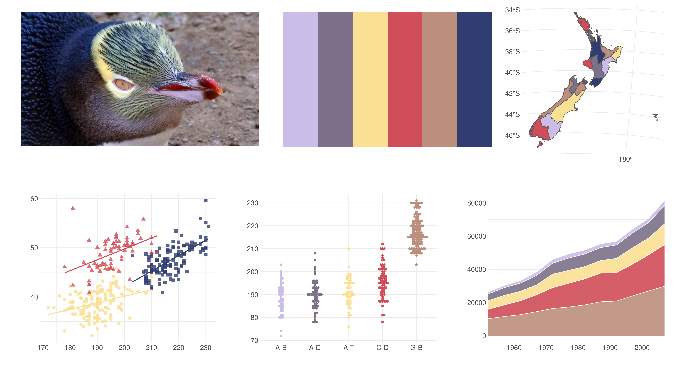
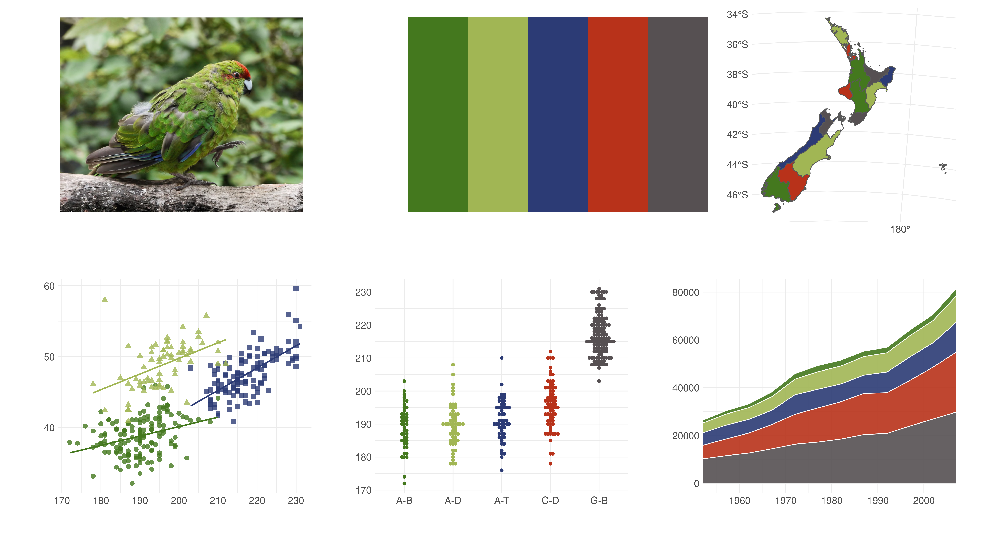
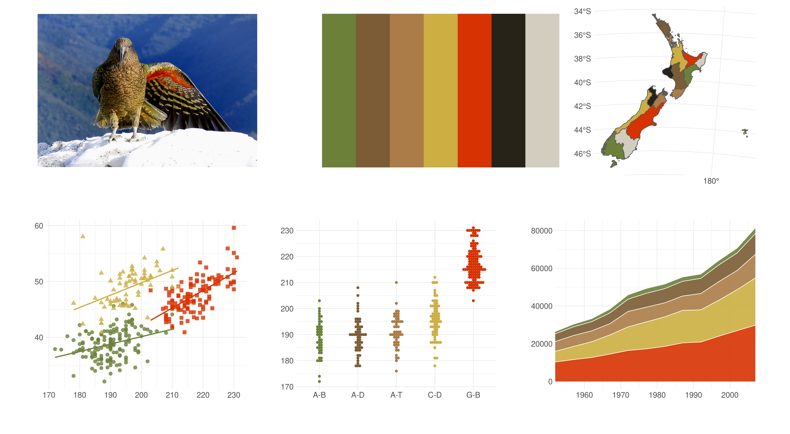
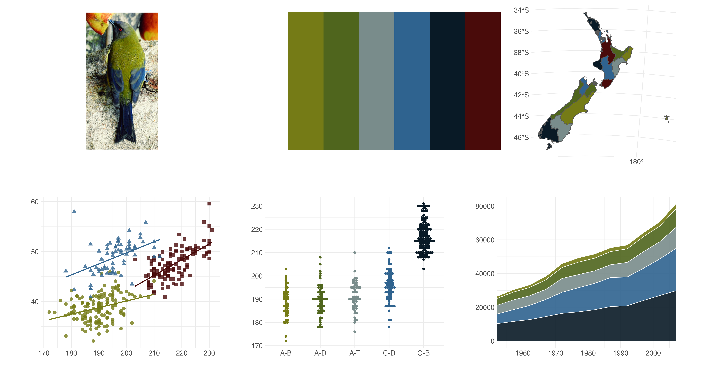
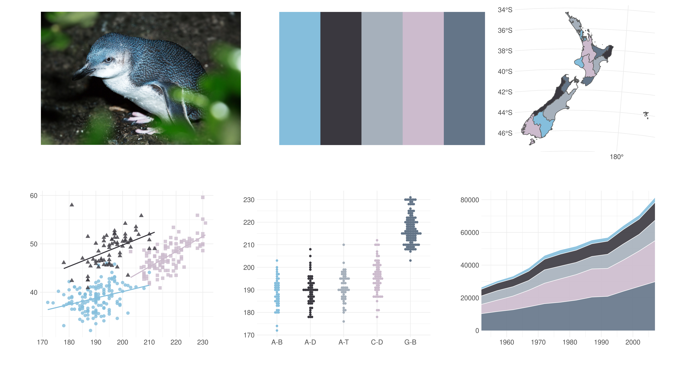
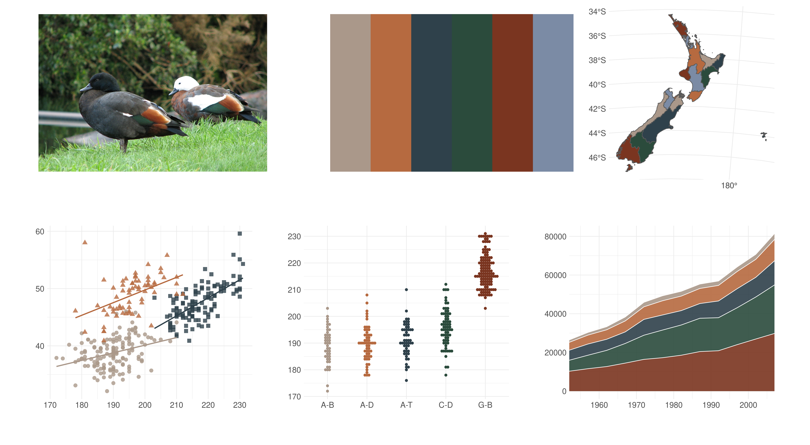
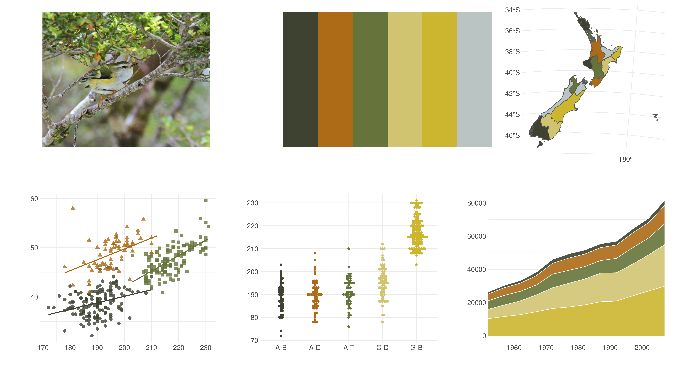
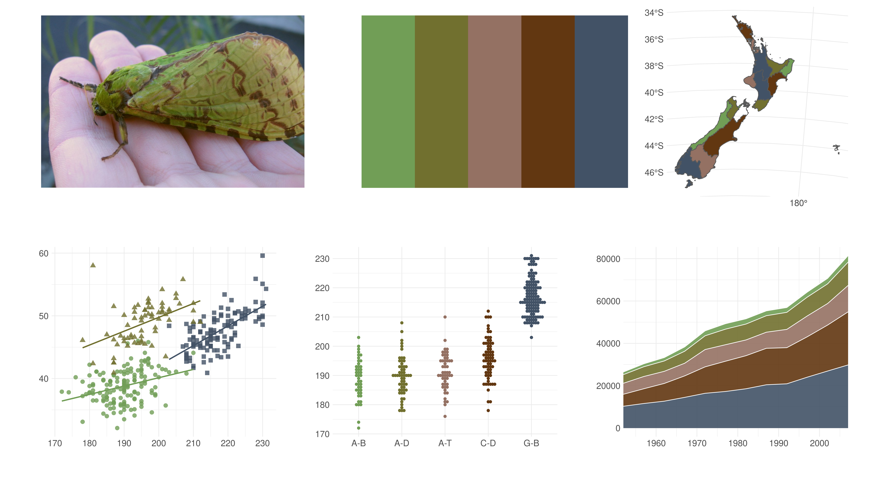
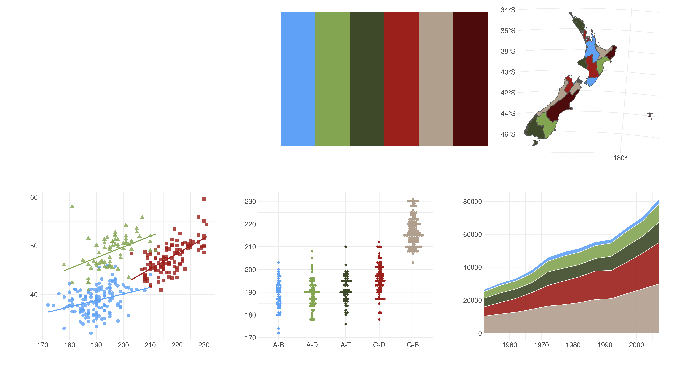

# Manu
This is a collection of colour palettes for fdata visualisation derived from photos of birds native to New Zealand.

```diff
- THIS REPO IS A WORK IN PROGRESS!!!!
```

You can install it using the `devtools` package:

``` r
# install.packages("devtools")
devtools::install_github("G-Thomson/Manu")
```
























